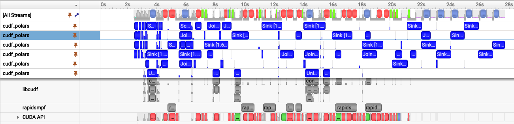
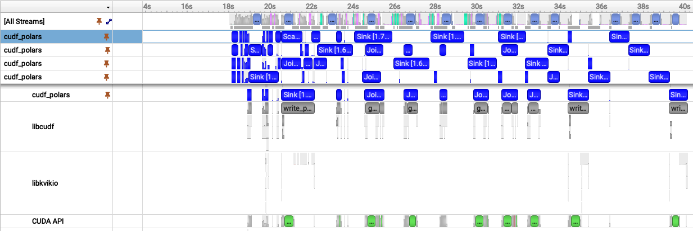
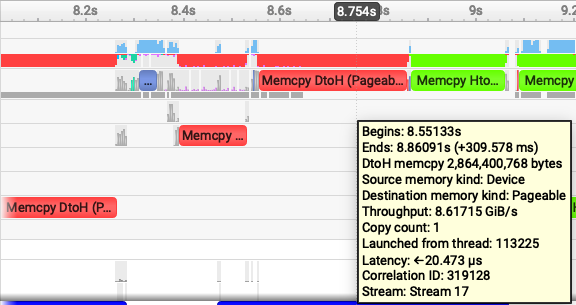
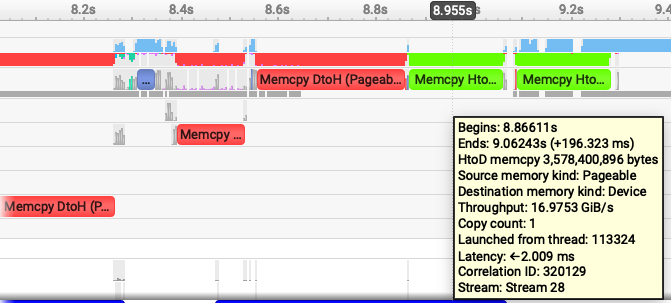
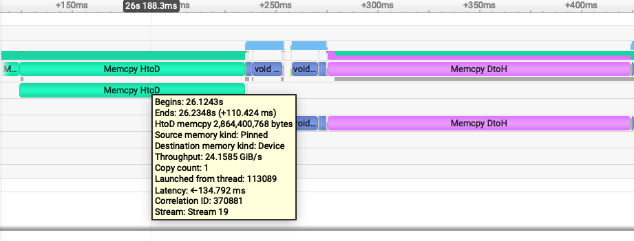
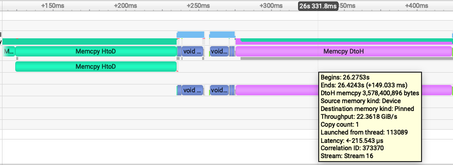

# Fancy Memory for ETL pt. 2

**Pinned memory changes both the cost of each transfer and the behavior of the pipeline. It pays an upfront allocation cost, but can reduce spill overhead, lower memory pressure, and improve end-to-end runtime**

In the previous post, I explored generally how spilling can enable larger than VRAM workloads to run on a GPU but comes with a cost AND how to reduce that cost with different memory.  In this post, I want to dive a little deeper into what's happening with pinned and pageable memory.  To do that exploration, we'll use [Nsight Systems](https://developer.nvidia.com/nsight-systems) (nsys) which can give us detailed profiling information on the workflow I developed in pt 1.  

> nsys profile -o pageable-spill -f true  -t cuda,nvtx --stats=false python script.py

As a reminder, I measured the same join workflow which requires more VRAM than an L40 has (44GB) using two different memory types `regular/pageable host memory: 27s` and `pinned host memory: 23s`.

*Fig 1. Nsight Systems timeline showing the pageable-memory cudf-polars join workflow.*

*Fig 2. Nsight Systems timeline showing the pinned-memory cudf-polars join workflow.*

With these two images laid out together, we can visually see similarities and differences:

1. Both have multiple cudf_polars streams (blue bars) though Fig 1. has 6 and Fig 2. has 5 -- let's come back to that
1. With pageable memory (fig 1) we see a load of red and green bars and it starts near the 2sec mark
1. With pinned memory (fig 2), we have some different colors but the bars aren't nearly as wide. Also, the time starts near the 18sec mark. This 18s is time to allocate all that pinned memory

As a reminder, here's the aggregate time spent spilling (device-to-host) and unspilling (host-to-device) for both memory types:

| Mode | Direction | Time |
| --- | --- | ---: |
| Pageable host spilling | Device -> host | 8.06 s |
| Pageable host spilling | Host -> device | 4.06 s |
| Pinned host spilling | Device -> pinned host | 2.64 s |
| Pinned host spilling | Pinned host -> device | 3.15 s |

It's interesting: pageable host spilling is slower when moving data Device->Host compared with Host->Device. However, when using pinned memory, the throughput in both directions is nearly the same. Why? Zooming into a region where the workflow is spilling can help us see why:

| Pageable device -> host | Pageable host -> device |
| --- | --- |
|  |  |

nsys lets us easily see not just how much time was spent spilling, but also how much data was transferred, and data/time gives us a throughput measurement. The following images are samples, each transfer will have some noise (a few may have spikes), but these are representative. In the zoomed-in images, Device->Host is 8.6GiB/s and Host->Device is ~17 GiB/s. When transferring data using regular pageable memory, the host has to first allocate memory before the device can spill and it's apparently quite costly to do this. When moving data *back* to the device, there is no allocation cost so it's significantly faster.

> cudf-polars and RapidsMPF use stream ordered memory as a default: [cudaMallocAsync](https://docs.nvidia.com/cuda/cuda-runtime-api/group__CUDART__MEMORY__POOLS.html#group__CUDART__MEMORY__POOLS_1gbbf70065888d61853c047513baa14081) but let's not get into this now

Let's do the same kind of inspection of the pinned memory nsys plot:

| Pinned host -> device | Pinned device -> host |
| --- | --- |
|  |  |

Device->Host data movement is a lot faster: 24 GiB/s and Host->Device is 22GiB/s. Pinned memory throughput is so much faster because we paid all the host memory allocation fees during initialization. The host doesn't have to allocate any memory -- it's already there for the device to use! 

Why though is Host->Device faster for pinned memory compared with pageable memory? It's great fun getting an excuse to learn about how machines actually work. We aren't going to dive very deep, but just peer into the depths without falling too far in.  

When the host allocates pageable memory, the operating system is still largely in control of that memory and still responsible for running the entire machine! The OS *can* move the memory to another physical location or even swap it to disk. This means the host, the OS, is responsible for moving the data and safeguarding the memory from corruption during the process. It's safe but slow, and one of the primary reasons why [Direct Memory Access (DMA)](https://en.wikipedia.org/wiki/Direct_memory_access) was created -- DMA dates back to [computing in the 50s](https://www.computerhistory.org/storageengine/storage-subsystems-emerge/) when everything was built by standards committees and when collectively, we started exploring the ideas of pipelining and overlapping execution.

With nsys we can start to see why pinned memory and DMA can be so impactful. (We may explore RDMA/GPUDirect RDMA in a later post.)

## More questions

So far we have looked at individual transfer costs; now let's connect that back to the full query timeline.  Why, if we spend 12 seconds spilling with pageable memory and only 5 seconds spilling with pinned memory, do we not see an overall time reduction of 7 seconds?  

It's understandably confusing because cuDF-Polars and RapidsMPF are doing work *concurrently* and, when the hardware allows it, *in parallel*. Spilling is not a single serial phase that blocks the whole query. Different chunks of the query can be in different stages at the same time: one chunk may be spilling to host, another may be unspilling back to the device, while another is running libcudf kernels. 

CUDA work in a single stream is ordered, but work submitted to different streams can overlap. RapidsMPF manages the pipeline for us, which is why the spill counters do not translate directly into overall execution time. 

This is also a good time to return to the stream-count puzzle from the nsys profiles at the beginning. 

> Both have multiple cudf_polars streams (blue bars) though Fig 1. has 6 and Fig 2. has 5 -- let's come back to that

The pageable run shows six active `cudf_polars` streams, while the pinned run shows five. That does not mean pageable memory has better parallelism.  We want higher perf, higher throughput, and overall lower execution time, not necessarily more parallelism or more concurrency, though those are both generally good traits.  The pageable transfers are slower, so more chunks pile up in flight and nsys shows more active streams. Pinned memory moves data faster, reduces memory pressure faster, and lets the pipeline drain sooner. 

With `num_py_executors`, cuDF-Polars sets the maximum number of Python worker threads available to drive RapidsMPF work. The number of active CUDA stream depends on how much independent work the query exposes at runtime, plus memory pressure, dependencies, and hardware availability. But the maximum number of Python worker threads is controlled by `num_py_executors`.

Pageable spilling spends more time moving data and can make the trace look busier because work backs up. Pinned spilling pays an upfront allocation cost (18s of burn-in time), but spends less time spilling during the query.  For larger out-of-core workflows, that can mean better throughput, less memory pressure, and fewer OOM surprises.

